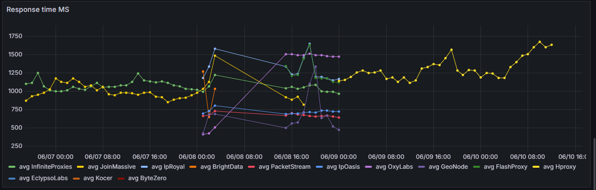
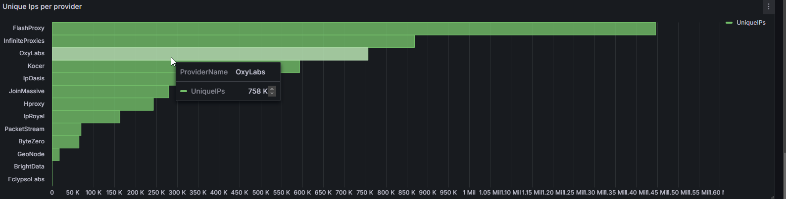
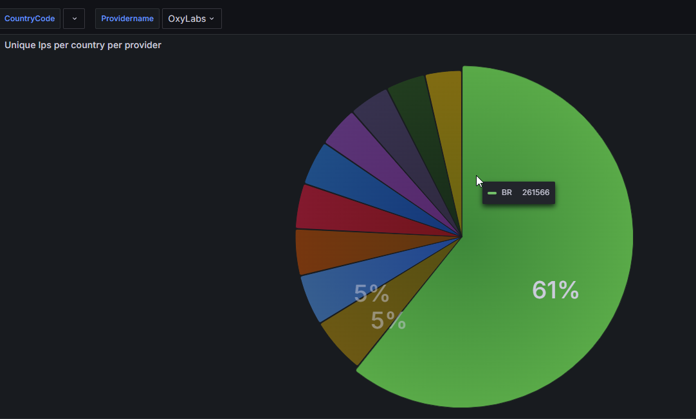
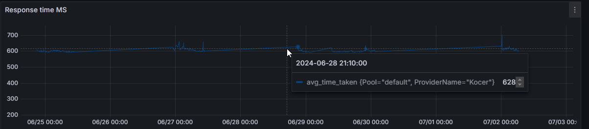

# Flux - Advanced Proxy Monitoring Tool

## Overview

**Flux** is a powerful tool designed to monitor proxy providers across the industry, analyzing response times, uptime, outgoing IPs, and more. With Flux, you can uncover the true performance and integrity of proxy providers, ensuring you're working with reliable data and not falling for misleading claims.

Certainly! Here are the individual sections for the README, tailored to include the features you mentioned:

### Features

- **Golang-Based:** Flux is built with Go, ensuring fast execution, concurrency support, and a lightweight footprint.
- **Low CPU Usage:** Optimized for minimal CPU usage, making it ideal for running in resource-constrained environments.
- **MaxMind Integration:** Integrated with MaxMind to provide accurate geolocation data for all analyzed IPs.
- **Low Bandwidth Consumption:** Designed to consume minimal bandwidth while collecting and processing data.
- **Web Interface:** Flux comes with a user-friendly web interface for easy monitoring and management.
- **Premade Dashboards:** Out-of-the-box dashboards to visualize key metrics and trends without the need for manual setup.
- **High Performance:** Capable of handling large datasets efficiently, with proven performance on databases with over 23 billion rows.
- **Scalable:** Built to scale with your needs, whether you're monitoring a few providers or hundreds.

## Installation

### Prerequisites

- Docker

### Clone the Repository

```bash
git clone https://github.com/xvertile/flux.git
cd flux/docker
```

### Run flux

On windows set the PWD variable to the current directory. Linux/Macos users can skip this step.
```bash
set PWD=%cd%
```
Creating the docker network
```bash
docker network create flux-network
```
Running the docker-compose file
```bash
docker-compose up -d --build
```
(Yes it's that simple)

## Usage
once flux is running you can access the web interface for jobs at `http://localhost:8080`. here you can start, stop and check the status of the jobs.

### Jobs
Jobs are a core component of Flux, responsible for running checks on proxies and storing the results in the database. You can create, edit, and delete jobs using the web interface.

#### Fields

- **Job Name**: The name of the job (e.g., `NetNut Job`).
- **Provider Name**: The name of the proxy provider (e.g., `NetNut`).
- **Proxy**: The proxy to be checked (e.g., `http://username:password@ip:port`).
- **Pool**: The pool of proxies to be checked (e.g., `premium`). Some providers offer multiple pools with varying performance characteristics.
- **Proxy Type**: The type of proxies to be checked (e.g., `Residential`, `Datacenter`, `Mobile`).
- **Threads**: The number of threads to use when checking proxies. More threads allow more proxies to be checked simultaneously but consume more resources. The recommended value is 50. Flux reuses HTTP clients to minimize resource consumption, so fewer threads can still achieve great speeds. For example, in testing, 150 threads completed 100,000 checks in 3 minutes.
- **URL**: The URL against which the proxy will be checked. This should be a URL that returns a 200 status code and displays the IP address when accessed (e.g., `https://icanhazip.com`, `https://wtfismyip.com/text`). The recommended URL is `icanhazip.com` due to its speed and lack of rate limiting.

## Grafana
Grafana is used to plot the data collected by flux. You can access the Grafana dashboard at `http://localhost:3000` with the default credentials `flux:flux`.
We have preconfigured dashboards for you to visualize the data collected by flux.

## Preconfigured Dashboards and collected data
### Preconfigured Dashboards
Flux comes with preconfigured dashboards to help you visualize the data collected by the tool. These dashboards provide insights into the performance and reliability of proxy providers, allowing you to make informed decisions based on real data.





### Collected Data
We have done a prior analysis of multiple proxy providers; these include:
- OxyLabs
- LightningProxies
- RainProxy
- IpRoyal
- GeoNode
- ZettaProxies
- InfiniteProxies
- ProxiesGG
- JoinMassive
- NetNut
- NimbleWay
- BrightData
- SmartProxy
- IpOasis
- PacketStream
- EclypsoLabs
- Kocer
- NodeMaven

This list contains over 222 million data points. If you would like to get a copy of this data, please reach out to us at [daan@bytezero.io](mailto:daan@bytezero.io)

## License
Flux is licensed under the MIT License. See `LICENSE` for more information.

## Contact
For questions or support, please reach out via [daan@bytezero.io](mailto:daan@bytezero.io) or open an issue on GitHub.

